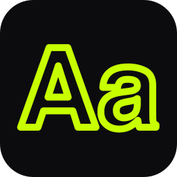

<!-- TODO: one day consider stylized SVG title headers instead of plain markdown headings -->

# SVG Text Animator

> Convert text into animated SVG paths with stroke and sweep reveal effects

    

**Live:** https://sirbepy.github.io/vectorize_text_for_stroke_animation/

---

## About

A browser-based tool that turns any text into animated SVG paths. Load a .ttf or .otf font, type your text, tweak animation parameters, and export a self-contained SVG file with CSS keyframe animations baked in.

Supports two render modes: stroke drawing (line-by-line outline animation) and sweep reveal (left-to-right fill wipe). Typography controls, color picker with recent history, and split code view for SVG markup and CSS are all included.

Built because creating animated text SVGs by hand is tedious - this automates the entire pipeline from font parsing to production-ready animated SVG.

---

## How to run

Open `index.html` in a browser.

---

## Project write-up

See [PORTFOLIO.md](.portfolio-data/PORTFOLIO.md) for the full project write-up.
